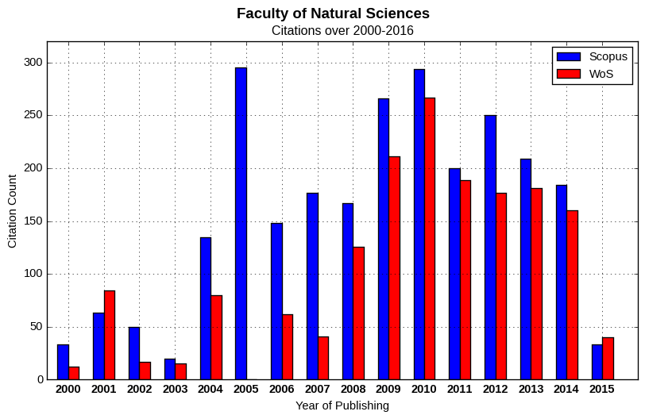

# scientometry-plot-gen

A command line plot generator that uses [matplotlib](http://matplotlib.org/) to
produce a set of bar chart plots visualizing publication and citation statistics
over range of years.  All relevant metadata for individual plots are defined by
metadata file in YAML format.  Plot data are being loaded from the set of data
files in CSV format located in the same directory.




## Installation

The `scientometry-plot-gen.py` script requires `matplotlib` and `yaml` Python
packages to run.  The script itself is usually placed into the working
directory, although it could be useful to place it e.g. into `~/bin` directory
and add `~/bin` to `PATH`.  Anyway, in current version, it has to be
executed from the the directory containing data file(s) as there is currently no
way to define alternative path to data files.

Following subsections describe how to install the dependency packages.

### Fedora

    $ sudo dnf install -y python-matplotlib python-yaml


### CentOS/RHEL

    $ sudo yum install -y python-matplotlib python-yaml


### Ubuntu/Debian

    $ sudo apt-get install python-matplotlib python-yaml


### Other Linux distro, Apple macOS, Other UNIX-like OS

    $ sudo pip install matplotlib pyyaml


### MS Windows

    > python -m pip install -U pip setuptools
    > python -m pip install matplotlib pyyaml


## Synopsis

```
usage: scientometry-plot-gen.py [-h] [-m MEATADATA_FILE] [PLOT [PLOT ...]]

Generate set of scientometric plots defined by METADATA_FILE
('plot-metadata.yaml' as default).  Individual PLOT entries has to match
sections of the metadata file.  If no PLOT is specified, all plots defined
in METADATA_FILE will be generated.

positional arguments:
  PLOT               plot name defined in METADATA_FILE

optional arguments:
  -h, --help         show this help message and exit

  -m MEATADATA_FILE  load metadata from METADATA_FILE

Data for each individual plot are loaded from a file in CSV format, named
'<PLOT_NAME>.csv', which has to be located in the working directory. The data
file name can be also specified instead of plot name when selecting a subset of
plots via PLOT argument(s). This comes very handy when using tab completititon.
```


## Usage examples

 1. Generate all plots defined in metadata file:

        $ ./scientometry-plot-gen.py

 2. Generate plots named `all-publications` and `all-citations` that are defined
    in `plot-metadata.yaml` (the default metadata file).

        $ ./scientometry-plot-gen.py all-publications all-citations

 3. Since data file names have to match plot names, you can use names of the
    data files as well, the `.csv` suffix will be ignored.  That comes very
    handy when using tab completition:

        $ ./scientometry-plot-gen.py all-publications.csv all-citations.csv

 4. You can also load metadata from the alternative metadata file.  Following
    command generates all plots defined in the `fns-citations-metadata.yaml`:

        $ ./scientometry-plot-gen.py -m fns-citations-metadata.yaml

 5. Making `scientometry-plot-gen.py` globally accessible:

        $ cp scientometry-plot-gen.py ~/bin
        $ export PATH=$PATH:~/bin
        $ cd ~/data
        $ ls
        data.csv
        metadata.yaml
        $ scientometry-plot-gen.py -m metadata.yaml


### Metadata file

The metadata file consists of `defaults` section and individual plot sections.
Keys and values of all plot sections are being merged with the `defaults`
section.  If the same key is being specified in both `defaults` and the plot
section, value defined in the plot section overrides the value in the `defaults`
section.  Plot sections has to have the same names as corresponding data files
(without `.csv` extension).  Values in the metadata file can contain UTF-8
characters.


#### List of valid metadata keys

Metadata key | Description
------------ | -----------
`format` | Output image format
`resolution` | Output image resolution in DPI
`figsize` | Physical width and height of the output image in centimeters
`suptitle_fontsize` | Font size of the supreme title (in points)
`title_fontsize` | Font size of the plot title (in points)
`ticklabel_fontsize` | Font size of the tick labels (in points)
`axislabel_fontsize` | Font size of the axis labels (in points)
`legend_fontsize` | Font size of the legend labels (in points)
`legend_loc` | legend box location (`right`, `center left`, `upper right`, `lower right`, `best`, `center`, `lower left`, `center right`, `upper left`, `upper center` or `lower center`)
`barwidth` | Relative width of the bars
`barcolors` | Bar colors for individual datasets (value order has to match columns in the data file)
`legend` | Legend labels for individual datasets (value order has to columns in the data file)
`suptitle` | Supreme title of the figure
`title` | Title of the plot
`title_y` | Vertical shift of the plot title (relatively to the plot border)
`xlabel` | Label of the x-axis
`ylabel` | Label of the y-axis
`ymax` | Maximal value of y-axis.


#### Example metadata file

```yaml
defaults:
  format: png
  resolution: 96 # [dpi]
  figsize:
    - 25.4 # width [cm]
    - 15.5 # height [cm]
  suptitle_fontsize: 14
  title_fontsize: 12
  ticklabel_fontsize: 11
  axislabel_fontsize: 11
  legend_fontsize: 11
  legend_loc: best
  title_y: 1.007
  barwidth: 0.3
  barcolors:
    - blue
    - red
  legend:
    - Scopus
    - WoS
  xlabel: Year of Publishing

all-citations:
  suptitle: Faculty of Natural Sciences
  title: Citations over 2000-2016
  ylabel: Citation Count
  ymax: 320
```

See [`fns-citations-metadata.yaml`](examples/fns-citations-metadata.yaml).


### Data file

Data file has to be in CSV (Comma separated Values) format where first column
contains list of years and following columns contain individual datasets that
are supposed to be visualized in single plot.  Order and total count of datasets
has to match the ordered lists defined by `barcolors` and `legend` metadata
keys.  The first line of the data file (the CSV header) is ignored.


#### Example data file

```
Year,Scopus,WoS
2000,33,12
2001,63,84
2002,50,17
2003,20,15
2004,135,80
2005,295,0
2006,148,62
2007,177,41
2008,167,126
2009,266,211
2010,294,267
2011,200,189
2012,250,177
2013,209,181
2014,184,160
2015,33,40
```

See [`fns-citations.csv`](examples/fns-citations.csv).


## License

scientometry-plot-gen.py -- Scientometric plot generator

Copyright (C) 2016  Juraj Szasz (<juraj.szasz3@gmail.com>)

This program is free software: you can redistribute it and/or modify it under
the terms of the GNU General Public License as published by the Free Software
Foundation, either version 3 of the License, or (at your option) any later
version.

This program is distributed in the hopet hat it will be useful, but WITHOUT ANY
WARRANTY; without even the implied warranty of MERCHANTABILITY or FITNESS FOR A
PARTICULAR PURPOSE.  See the GNU General Public License for more details.

You should have received a copy of the GNU General Public License along with
this program.  If not, see <http://www.gnu.org/licenses/>.
