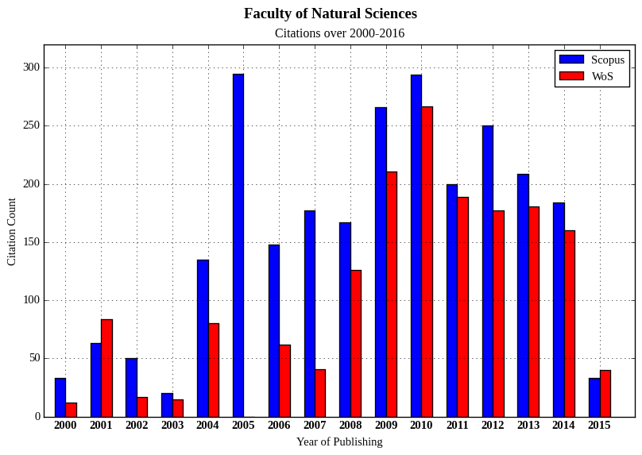

# scientometry-plot-gen

A command line plot generator that produces a set of bar chart plots
visualizing publication and citation statistics over range of years.  All
relevant metadata for individual plots are defined by YAML file.  Plot data are
being loaded from the set of data files in CSV format located in the same
directory.

The *scientometry-plot-gen* scientometric plot generator that uses
[matplotlib](http://matplotlib.org/) to generate set of scientometric plots for
publishing purposes.




## Installation

The script require `matplotlib` and `yaml` Python packages to run.  It has to be
placed to into the same directory as data file(s) and metadata YAML file(s).

### Fedora 22+

```
# dnf install -y python-matplotlib python-yaml`
```

### CentOS/RHEL, older Fedora

```
# yum install -y python-matplotlib python-yaml`
```

### Other Linux distro or OS

```
# pip install matplotlib yaml
```


## Synopsis

```
usage: ./scientometry-plot-gen.py [-h] [-m MEATADATA_FILE] [PLOT [PLOT ...]]

Generate set of scientometric plots defined by METADATA_FILE. If no PLOT is
specified, all plots defined in METADATA_FILE will be generated.

positional arguments:
  PLOT               plot name defined in METADATA_FILE

optional arguments:
  -h, --help         show this help message and exit
  -m MEATADATA_FILE  load metadata from METADATA_FILE. Uses 'plot_metadata.yaml'
                     as default.
```


## Usage Examples

1. Generate all plots defined in metadata YAML file:

   `$ ./scientometry_plot_gen.py`

2. Generate plots named `all-publications` and `all-citations` that are defined
   in `plot-metadata.yaml` (the default metadata YAML file).

   `$ ./scientometry_plot_gen.py all-publications all-citations`

3. Since data file names have to match plot names, you can use names of the data
   files as well, the `.csv` suffix will be ignored.  That comes very handy when
   using Tab completition:

    `$ ./scientometry_plot_gen.py all-publications.csv all-citations.csv`

4. You can also load metadata from the alternative metadata YAML file.
   Following command generates all plots defined in the
   `all-citations-metadata.yaml`:

   `$ ./scientometry_plot_gen.py -m all-citations-metadata.yaml`


### Metadata YAML file

The metadata YAML file has `defaults` section that is being applied to all plots
and individual plot sections that has to have the same names as individual data
files (without `.csv` extension).  Text in the YAML file can contain UTF-8
characters.

*all-citations-metadata.yaml:*

```yaml
defaults:
  format: png
  resolution: 96 # [dpi]
  figsize:
    - 25.4 # width [cm]
    - 15.5 # height [cm]
  suptitle_fontsize: 14
  title_fontsize: 12
  ticklabel_fontsize: 11
  axislabel_fontsize: 11
  legend_fontsize: 11
  title_y: 1.007
  barwidth: 0.3
  barcolors:
    - 'blue'
    - 'red'
  legend:
    - "Scopus"
    - "WoS"
  xlabel: "Year of Publishing"

all-citations:
  suptitle: "Faculty of Natural Sciences"
  title: "Citations over 2000-2016"
  ylabel: "Citation Count"
  ymax: 320
```

* `format` -- Format of the output file
* `resolution` -- Output resolution in dpi
* `figsize` -- Dimensions of the output figure (in cm)
* `suptitle_fontsize` -- Font size of the supreme title (in pt)
* `title_fontsize` -- Font size of the plot title (in pt)
* `ticklabel_fontsize` -- Font size of the tick labels (in pt)
* `axislabel_fontsize` -- Font size of the axis labels (in pt)
* `legend_fontsize` -- Font size of the legend labels (in pt)
* `barwidth` -- Relative width of the bars
* `barcolors` -- Bar colors for individual data sets
* `legend` -- Legend labels for individual data sets
* `suptitle` -- Supreme title of the figure
* `title` -- Plot title
* `title_y` -- Vertical shift of the plot title (relatively to plot border)
* `xlabel` -- Label of the x-axis
* `ylabel` -- Label of the y-axis
* `ymax` -- Maximal value of y-axis.


### Data file

Data file has to be in CSV (Comma separated Values) format where first column
contains list of years and following columns contain individual datasets that
are supposed to be visualized in single plot.  Order and total count of datasets
has to match the content `barcolors` and `legend` metadata entries.

*all-citations.csv:*

```
2000,33,12
2001,63,84
2002,50,17
2003,20,15
2004,135,80
2005,295,0
2006,148,62
2007,177,41
2008,167,126
2009,266,211
2010,294,267
2011,200,189
2012,250,177
2013,209,181
2014,184,160
2015,33,40
```


## License

*scientometry-plot-gen.py -- Scientometric plot generator*

Copyright (C) 2016  Juraj Szasz (juraj.szasz3@gmail.com)

This program is free software: you can redistribute it and/or modify it under
the terms of the GNU General Public License as published by the Free Software
Foundation, either version 3 of the License, or (at your option) any later
version.

This program is distributed in the hopet hat it will be useful, but WITHOUT ANY
WARRANTY; without even the implied warranty of MERCHANTABILITY or FITNESS FOR A
PARTICULAR PURPOSE.  See the GNU General Public License for more details.

You should have received a copy of the GNU General Public License along with
this program.  If not, see [GNU licenses](http://www.gnu.org/licenses/).
